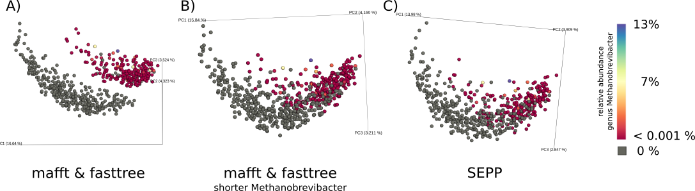
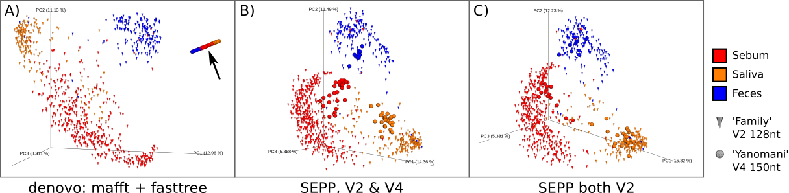

[](https://travis-ci.org/biocore/q2-fragment-insertion)

## Installation

Once QIIME2 is [installed](https://docs.qiime2.org/2018.2/install/), and you activated your QIIME2 environment, it should be possible to install `q2-fragment-insertion` with:

    conda install -c https://conda.anaconda.org/biocore q2-fragment-insertion
    qiime dev refresh-cache
    
**Troubleshoot 'PackagesNotFoundError':**
Your conda installation might fail with a 'PackagesNotFoundError' message. This is most likely due to missing channels. Try to re-run the above command with explicit addition of four more channels:

    conda install -c anaconda -c defaults -c conda-forge -c bioconda -c https://conda.anaconda.org/biocore q2-fragment-insertion
    qiime dev refresh-cache

## Why you should prefer fragment insertion AKA SEPP over de-novo trees

### Fragment insertion avoids artificially long outgroup branches that would lead to exaggerated separation in beta diversity.



Beta diversity was computed for all 599 samples of [this study](https://qiita.ucsd.edu/study/description/10422) (manuscript in preparation) on the deblur table rarefied to 5,870 sequences per sample with 4,727 sub-operational-taxonomic-units ([sOTU](http://msystems.asm.org/content/2/2/e00191-16)) total as unweighted unifrac distance with three alternative phylogenetic trees:

  A) De-novo by aligning 249nt long fragments via mafft and inferring a tree via fasttree - as suggested in the QIIME 2 "moving pictures" [tutorial](https://docs.qiime2.org/2017.10/tutorials/moving-pictures/#generate-a-tree-for-phylogenetic-diversity-analyses). Strong separation between observed clusters cannot be explained by any metadata, but the relative abundance of three sOTUs belonging to the genus *Methanobrevibacter*: not detectable in lower gray cluster, very low abundant in upper coloured cluster.

  B) Mean path length from root to tips in the denovo tree is 0.94, while the lowest common ancestor for the three *Methanobrevibacter* sOTUs has an outstanding length of 1.43. Manually shortening the grandparent's branch length from 0.82 to 0.4 re-unites clusters.

  C) Inserting denovo fragments into a well curated reference phylogeny via the fragment insertion plugin also resolves cluster separation but does not require any manual manipulation.

Note: the same effects are observed when the sOTU table is not rarefied.

### Fragment insertion enables meta-analyses across different variable 16S regions and fragment length.



Meta-analyses of two microbiome studies with heterogeneous variable 16S regions.
Both studies sampled the same three body products: [Study 'Family'](https://qiita.ucsd.edu/study/description/797) contains 854 human and 217 dog samples with 37,181 sOTUs of the first 128nt from V2 [[Song et al.]](http://dx.doi.org/10.7554/eLife.00458), while [study 'Yanomani'](https://qiita.ucsd.edu/study/description/10052) comprises 66 samples of uncontacted Amerindians in Venezuela with 17,249 sOTUs of the first 150nt of V4 [[Clemente et al.]](http://dx.doi.org/10.1126/sciadv.1500183).
Beta diversity was computed on one non rarefied deblur table combining both studies as unweighted UniFrac distance.

  A) De-novo tree construction via aligning sOTU sequences with mafft and reconstructing the phylogeny via fasttree results in strong artifacts in Principal Coordinate Analysis (PCoA) (note the black arrow), because separation is extremely driven by variable region.

  B) Inserting sOTU sequences from different regions into the same backbone tree as SEPP does, results in a phylogeny that separates samples as expected in PCoA space by body product. Study effect is rather marginal.

  C) The 'Yanomani' samples were additionally profiled targeting the V2 region, thus we could insert the resulting 6,604 sOTUs together with the 'Family' study samples into the same phylogeny as a positive control. Separation is indeed driven by "body product" and not by study.

## Notes

Default reference (phylogeny and matching alignment) is Greengenes 13_8 at 99%.
You can provide your own reference via optional inputs `--i-reference-alignment` and `--i-reference-phylogeny`. Make sure that every tip of the reference phylogeny has exactly one corresponding sequence in the reference alignment. Insertion taxonomic lineage information can be obtained from the provided reference phylogeny, by concatenating internal node labels along the path from the root to the inserted fragment. Only node labels are considerd which contain Greengenes like infixes with two underscores `_` `_`, indicating taxonomic labels. Your reference phylogeny might contain other internal node labels which are not taxonomic labels.

Sequences which are not at least 75% similar by sequence identity to any record in the tree to insert into are not inserted into the tree.

A fragment may be reasonable to insert into multiple locations. However, downstream methods such as UniFrac cannot currently handle placement distributions. As such, the placement with the highest likelihood is choosen.

## Files produced

The plugin will generate two files:
  1. A `Phylogeny[Rooted]` type: This is the tree with the sequences placed (which could be inserted), and are identified by their corresponding sequence IDs. You can directly use this tree for phylogenetic diversity computation like UniFrac or Faith's Phylogenetic Diversity.
  2. A `Placements` type: It is a JSON object which, for every input sequence, describes the different possible placements.

## Example

QIIME 2's "Moving Pictures" [tutorial](https://docs.qiime2.org/2017.10/tutorials/moving-pictures/#generate-a-tree-for-phylogenetic-diversity-analyses) suggests constructing a de-novo phylogeny for the fragments, i.e `FeatureData[Sequence]`, to obtain a `Phylogeny[Rooted]` that can be used for phylogenetic diversity computation. "Fragment insertion" via this plugin provides an alternative way to acquire the `Phylogeny[Rooted]` by inserting sequences of `FeatureData[Sequence]` into a high quality reference phylogeny and thus provides multiple advantages over de-novo phylogenies, e.g. accurate branch lengths, multi-study meta-analyses, mixed region meta-analyses (e.g. V4 and V2).

Let us use the `FeatureData[Sequence]` from QIIME's tutorial as our input:

   - `rep-seqs.qza`: [view](https://view.qiime2.org/?src=https%3A%2F%2Fdocs.qiime2.org%2F2017.10%2Fdata%2Ftutorials%2Fmoving-pictures%2Frep-seqs.qza) | [download](https://docs.qiime2.org/2017.10/data/tutorials/moving-pictures/rep-seqs.qza)

The following single command will produce two outputs: 1) `phylogeny.qza` is the `Phylogeny[Rooted]` and 2) `placements.qza` provides placement distributions for the fragments (you will most likely ignore this output) (Computation might take some 10 minutes):
```
qiime fragment-insertion sepp \
  --i-representative-sequences rep-seqs.qza \
  --o-tree insertion-tree.qza \
  --o-placements insertion-placements.qza
```
Output artifacts:
   - `insertion-tree.qza`: ~[view]()~ | [download](https://github.com/biocore/q2-fragment-insertion/blob/master/Example/insertion-tree.qza?raw=true)
   - `insertion-placements.qza`: ~[view]()~ | [download](https://github.com/biocore/q2-fragment-insertion/blob/master/Example/insertion-placements.qza?raw=true)

You can then use `insertion-tree.qza` for all downstream analyses, e.g. "Alpha and beta diversity analysis", instead of `rooted-tree.qza`.

### Expected Runtimes

We ran ``qiime fragment-insertion sepp`` on four of 32 cores of a Intel(R) Xeon(R) CPU E5-2640 v3 @ 2.60GHz server with 265 GB available RAM. Reported "time" is accumulated "user time". Runtime only depends on number of sOTUs, not on number of samples.

| QIITA ID<sup>[1](#myfootnote1)</sup>|sOTUs	|samples|sOTU length| memory (max RSS)|time (hh:mm)|wall time (hh:mm)|
|:--------:|-------:|------:|----------:|----------------:|:----------:|:---------------:|
| [10422](https://qiita.ucsd.edu/study/description/10422)	   |4,702	|647	|150 nt	    |10.4 GB	      |01:37	   |00:31            |
| [11274](https://qiita.ucsd.edu/study/description/11274)	   |4,727	|599	|249 nt	    |10.3 GB	      |02:44	   |00:48            |
| [850](https://qiita.ucsd.edu/study/description/850)	   |11,301	|528	|90 nt	    |10.2 GB	      |02:07	   |00:40            |
| [10343](https://qiita.ucsd.edu/study/description/10343)	   |14,245	|389	|150 nt	    |10.3 GB	      |06:10	   |01:45            |
| [1024](https://qiita.ucsd.edu/study/description/1024)	   |21,473	|344	|150 nt	    |10.2 GB	      |06:32	   |01:54            |
| [2014](https://qiita.ucsd.edu/study/description/2014)	   |23,029	|1,017	|150 nt	    |10.2 GB	      |08:45	   |02:27            |
| [550](https://qiita.ucsd.edu/study/description/550)	   |27,791	|1,967	|100 nt	    |10.4 GB	      |05:49	   |01:43            |
| [2136](https://qiita.ucsd.edu/study/description/2136)	   |29,702	|504	|150 nt	    |10.4 GB	      |08:48	   |02:33            |
| [10315](https://qiita.ucsd.edu/study/description/10315)	   |31,784	|199	|150 nt	    |10.2 GB	      |09:35	   |02:47            |
| [10346](https://qiita.ucsd.edu/study/description/10346)	   |108,447	|1,292	|100 nt	    |10.4 GB	      |20:59	   |06:07            |

<a name="myfootnote1">1</a>: You need to log into Qiita to access the listed studies.

The sweet spot to execute ``qiime fragment-insertion sepp`` on barnacle is 20 cores with 8 GB memory for each core, i.e. 160 GB in total.

### Assign taxonomy

The *fragment-insertion* plugin provides an experimental method to assign a taxonomic lineage to every fragment. Assume the tips of your reference phylogeny are e.g. OTU-IDs from Greengenes (which is the case when you use the default reference). If you have a taxonomic mapping for every OTU-ID to a lineage string, as provided by Greengenes, function `classify_otus-experimental` will detect the closest OTU-IDs for every fragment in the insertion tree and report this OTU-IDs lineage string for the fragment. Thus, the function expects two required input artifacts: 1) the representative-sequences of type `FeatureData[Sequence]` and 2) the resulting tree of a previous `sepp` run which is of type `Phylogeny[Rooted]`. For the example, we also specify a third, optional input [taxonomy_gg99.qza](https://raw.githubusercontent.com/biocore/q2-fragment-insertion/master/taxonomy_gg99.qza) of type `FeatureData[Taxonomy]`.

    qiime fragment-insertion classify-otus-experimental \
      --i-representative-sequences rep-seqs.qza \
      --i-tree insertion-tree.qza \
      --i-reference-taxonomy taxonomy_gg99.qza \
      --o-classification taxonomy.qza

Output artifacts:
   - `insertion-taxonomy.qza`: ~[view]()~ | [download](https://github.com/biocore/q2-fragment-insertion/blob/master/Example/insertion-taxonomy.qza?raw=true)

You need to make sure, that the `--i-reference-taxonomy` matches the reference phylogeny used with function `sepp`.
This method is experimental as of Nov. 22nd 2017, since we have not yet evaluated the quality / correctness of the returned lineages. Use on your own risk!

### Import representative sequencs into QIIME 2 artifact

Assume you have a collection of representative sequences as a multiple fasta file, e.g. from downloading a `reference-hit.seqs.fa` Qiita file. You can *import* this file into a QIIME 2 artifact with the following command:

    qiime tools import \
    --input-path reference-hit.seqs.fa \
    --output-path reference-hit.seqs.qza \
    --type "FeatureData[Sequence]"    

The command will produce a new file with the name `reference-hit.seqs.qza`, which you can use as input `--i-representative-sequences` for the *fragment-insertion* plugin.

## Create conda packages (Developers only)

Obtain latest sources from this git repository:

    git clone https://github.com/biocore/q2-fragment-insertion.git

Move into newly cloned directory:

    cd q2-fragment-insertion

Execute the build command via a Makefile target:

    make conda

Upload the newly created conda package to biocore:

    anaconda upload -u biocore q2-fragment-insertion-0.1.0-py35h3e8d850_1.tar.bz2

Remember to do that for both, Linux and OSX.

## How to import taxonomy tables

The plugin function `classify_otus-experimental` allows to pass in *reference taxonomic table* via argument `--i-reference-taxonomy`. You can import a tab-separated two-column table where first column is the OTU-ID and the second column is the ";" separated lineage string via the following command as an QIIME 2 artifact. Make sure your table does **not** contain a header line:

    qiime tools import \
    --input-path taxonomy.tsv \
    --source-format HeaderlessTSVTaxonomyFormat \
    --type "FeatureData[Taxonomy]" \
    --output-path foo.qza

## How to cite

If you use this plugin for any published research, please include the following citation:

[Phylogenetic Placement of Exact Amplicon Sequences Improves Associations with Clinical Information.](https://doi.org/10.1128/mSystems.00021-18)
Stefan Janssen, Daniel McDonald, Antonio Gonzalez, Jose A. Navas-Molina, Lingjing Jiang, Zhenjiang Zech Xu, Kevin Winker, Deborah M. Kado, Eric Orwoll, Mark Manary, Siavash Mirarab, Rob Knight.
mSystems 2018.
doi: https://doi.org/10.1128/mSystems.00021-18
